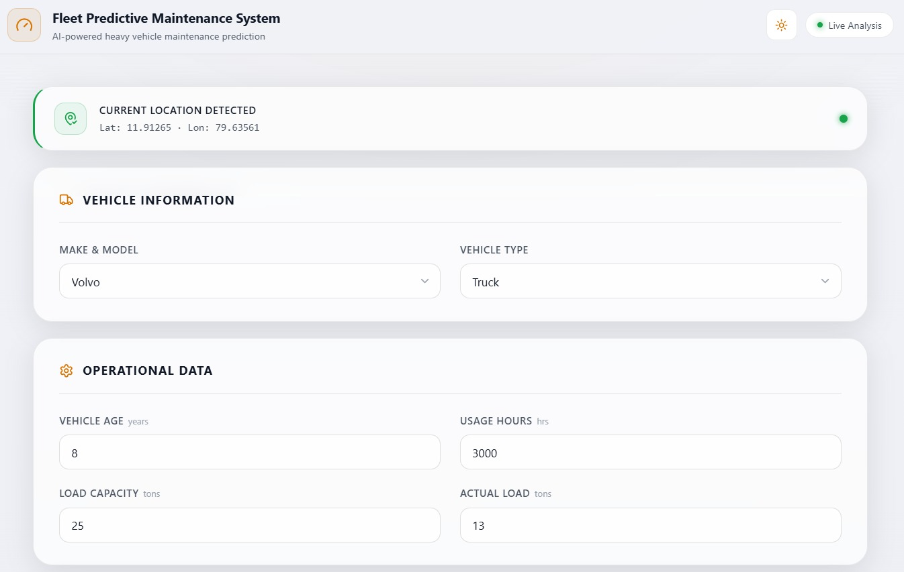
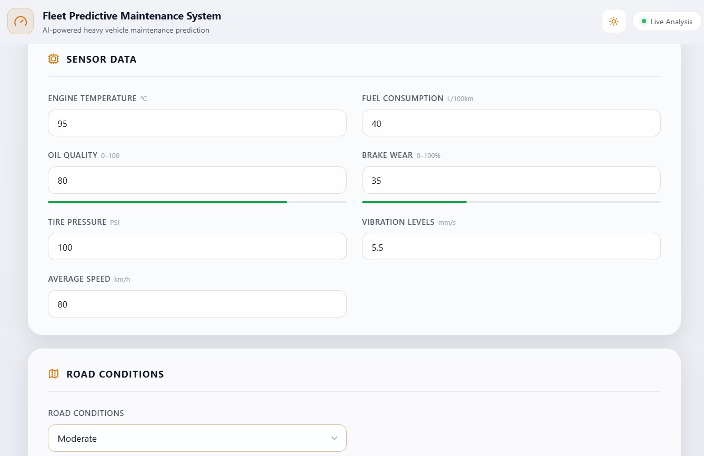
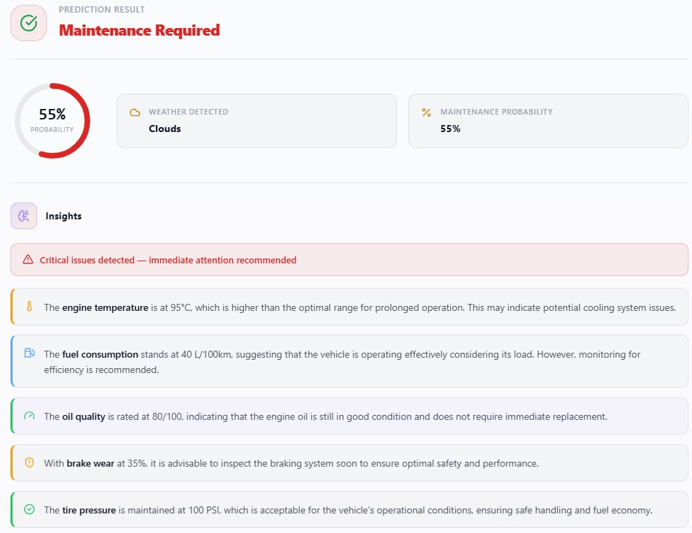

<div align="center">

# 🚛 Fleet Maintenance Prediction System

**An end-to-end Machine Learning system that predicts vehicle maintenance needs from real-time fleet operational data.**

[](https://python.org)
[](https://flask.palletsprojects.com)
[](https://scikit-learn.org)
[](LICENSE)

[Features](#-features) · [Architecture](#-architecture) · [API Docs](#-api-reference) · [Setup](#-getting-started) · [Screenshots](#-screenshots)

</div>

---

## 📌 Overview

The Fleet Maintenance Prediction System is a full-stack ML application that helps fleet managers **proactively identify vehicles requiring maintenance** before failures occur. By analyzing operational parameters such as engine temperature, brake wear, oil quality, and usage hours, the system delivers real-time predictions via a REST API backed by a trained Random Forest classifier.

> **Use Case:** Reduce unplanned downtime, lower repair costs, and extend vehicle lifespan through data-driven maintenance scheduling.

---

## ✨ Features

- 🔮 **Real-time Predictions** — Instant maintenance forecasts via REST API
- 🧠 **ML-Powered** — Random Forest classifier trained on fleet operational data
- 📊 **Rich Feature Set** — 15 input features covering engine, tyres, load, weather & more
- 🌐 **Simple Frontend** — Clean HTML/CSS/JS interface for manual predictions
- ⚡ **Lightweight & Fast** — Minimal dependencies, low-latency inference
- 📦 **Serialized Model** — Pre-trained `.pkl` model for instant deployment

---

## 🏗️ Architecture

```
┌─────────────────────────────────┐
│           FRONTEND              │
│     HTML  │  CSS  │  JavaScript │
└──────────────┬──────────────────┘
               │  Fetch API  (JSON POST)
               ▼
┌─────────────────────────────────┐
│        FLASK BACKEND            │
│           app.py                │
│    Input Validation &           │
│      Preprocessing              │
└──────────────┬──────────────────┘
               │
               ▼
┌─────────────────────────────────┐
│      ML MODEL  (Scikit-learn)   │
│   RandomForestClassifier        │
│   maintenance_model.pkl         │
└──────────────┬──────────────────┘
               │  Prediction (0 / 1)
               ▼
┌─────────────────────────────────┐
│       JSON RESPONSE             │
│  prediction · probability ·     │
│  weather_detected · result      │
└─────────────────────────────────┘
```

---

## 🧠 ML Pipeline

| Step | Description |
|------|-------------|
| 1. Data Collection | Fleet operational CSV dataset |
| 2. Data Cleaning | Handle nulls, outliers, type casting |
| 3. Feature Engineering | Encode categoricals, normalize numerics |
| 4. Model Training | `RandomForestClassifier` via Scikit-learn |
| 5. Serialization | Export model as `maintenance_model.pkl` |
| 6. API Integration | Serve predictions through Flask endpoint |

---

## 📁 Project Structure

```
FleetMaintenancePrediction/
│
├── backend/
│   ├── app.py                        # Flask application & API routes
│   ├── models/
│   │   ├── maintenance_model.pkl     # Trained ML model
│   │   └── feature_names.pkl         # Feature column metadata
│   └── fleet_prediction_dataset.csv  # Training dataset
│
├── frontend/
│   ├── index.html                    # Main UI page
│   ├── style.css                     # Styling
│   └── script.js                     # Fetch API & form handling
│
├── screenshots/
│   ├── ss1.png
│   ├── ss2.png
│   └── ss3.png
│
└── README.md
```

---

## 🚀 Getting Started

### Prerequisites

- Python 3.9+
- pip

### Installation

```bash
# 1. Clone the repository
git clone https://github.com/ematty246/FleetMaintenancePrediction.git
cd FleetMaintenancePrediction

# 2. Install dependencies
pip install flask scikit-learn pandas numpy

# 3. Start the Flask server
cd backend
python app.py
```

The API will be available at `http://localhost:5000`.

### Frontend

Open `frontend/index.html` directly in your browser, or serve it with:

```bash
cd frontend
python -m http.server 8080
```

---

## 📡 API Reference

### `POST /predict`

Predict whether a vehicle requires maintenance based on its current operational data.

**Request Body**

```json
{
  "Make_and_Model": "Toyota",
  "Vehicle_Type": "Truck",
  "Vehicle_Age": 2,
  "Usage_Hours": 1200,
  "Load_Capacity": 25,
  "Actual_Load": 15,
  "Engine_Temperature": 75,
  "Fuel_Consumption": 8,
  "Oil_Quality": 95,
  "Brake_Wear_Percentage": 10,
  "Tire_Pressure": 32,
  "Vibration_Levels": 2,
  "Road_Conditions": "Good",
  "Average_Speed": 60,
  "Weather_Conditions": "Rain"
}
```

**Response**

```json
{
  "prediction": 0,
  "maintenance_probability": 3.12,
  "weather_detected": "Clear",
  "result": "No Maintenance Required"
}
```

**Response Fields**

| Field | Type | Description |
|-------|------|-------------|
| `prediction` | `int` | `0` = No maintenance, `1` = Maintenance required |
| `maintenance_probability` | `float` | Probability score (0–100%) |
| `weather_detected` | `string` | Weather parsed from input |
| `result` | `string` | Human-readable prediction label |

---

## 📊 Input Features

| Feature | Type | Description |
|---------|------|-------------|
| `Make_and_Model` | string | Vehicle make (e.g., Toyota, Ford) |
| `Vehicle_Type` | string | Truck / Van / Car |
| `Vehicle_Age` | int | Age in years |
| `Usage_Hours` | int | Total operating hours |
| `Load_Capacity` | float | Max load capacity (tonnes) |
| `Actual_Load` | float | Current load (tonnes) |
| `Engine_Temperature` | float | Engine temp in °C |
| `Fuel_Consumption` | float | L/100km |
| `Oil_Quality` | float | Oil quality index (0–100) |
| `Brake_Wear_Percentage` | float | Brake pad wear % |
| `Tire_Pressure` | float | PSI |
| `Vibration_Levels` | float | Vibration index |
| `Road_Conditions` | string | Good / Fair / Poor |
| `Average_Speed` | float | km/h |
| `Weather_Conditions` | string | Clear / Rain / Snow / Fog |

---

## 📸 Screenshots

| Home / Input Form | Prediction Result | Dashboard |
|:-----------------:|:-----------------:|:---------:|
|  |  |  |

---

## 🛠️ Tech Stack

| Layer | Technology |
|-------|------------|
| Language | Python 3.9+ |
| Backend Framework | Flask |
| ML Library | Scikit-learn |
| Data Processing | Pandas, NumPy |
| Model Storage | Pickle (`.pkl`) |
| Frontend | HTML5, CSS3, Vanilla JS |

---

## 🗺️ Roadmap

- [ ] Cloud deployment (AWS / Render + Netlify)
- [ ] JWT-based authentication
- [ ] Swagger / OpenAPI documentation
- [ ] Deep learning model (LSTM for time-series)
- [ ] Real-time IoT vehicle data integration
- [ ] Dashboard with maintenance history & analytics
- [ ] Docker containerization

---

## 🤝 Contributing

Contributions are welcome! Please open an issue first to discuss proposed changes.

```bash
# Fork → Clone → Branch → PR
git checkout -b feature/your-feature-name
```

---

## 📄 License

This project is licensed under the [MIT License](LICENSE).

---

<div align="center">

**Built with ❤️ as a Machine Learning + Full Stack Portfolio Project**

⭐ Star this repo if you found it useful!

</div>
